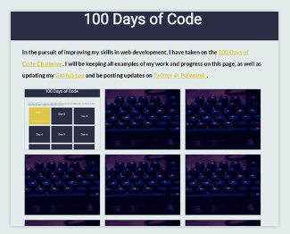
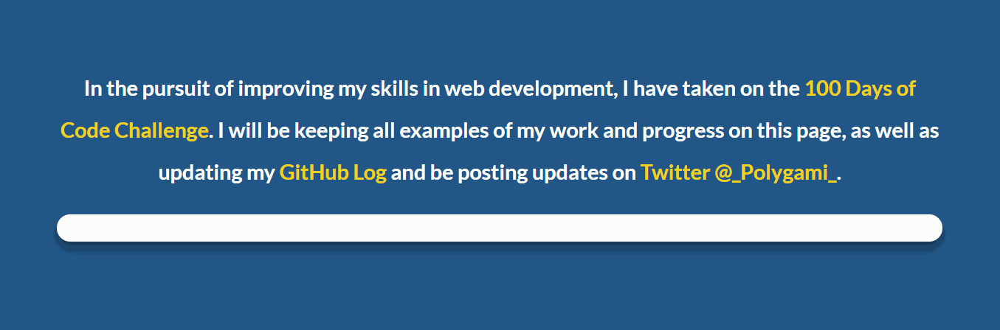
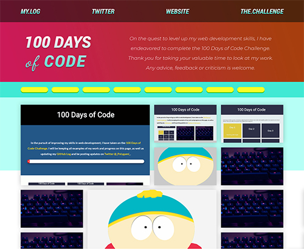

# 100 Days Of Code - Log

### Day 0: April 25, 2019
**Today's Progress**: Got things set up by:
- Creating a markdown code snippet in Visual Studio Code, to quickly add log entries.
- Setting up a repository on my GitHub account which will contain all of my work over the next 100 days.

**Thoughts:** I *really* didn't do all that much tangible today, but I put everything in place to start tomorrow, when I want to continue creating a decent looking website to show my work (and progress) on GitHub.

**Link(s) to work:** [My GitHub.io Page](https://polygami.github.io/)

---

### Day 1: April 27, 2019
**Today's Progress**: Today I added some basic CSS for the header, footer and link cards. I also added some additional HTML to show the first 50 days.

**Thoughts:** I got off to a good start today, but I am having a bit of trouble with positioning the text within the cards. It seems to have extra padding and I'm not sure if this is an issue caused by Flexbox or not. Tomorrow I will try and fix it.

**Link(s) to work:** [Day 1 - 100 Days of Code](https://polygami.github.io/days/1/day1.html)

---

### Day 2: April 28, 2019
**Today's Progress**: I spent a good few hours today adding some CSS transitions to each of the cards in my page. I also added a JavaScript file, to add a placeholder image to incomplete days and place a day-specific thumbnail to each completed day, based on a naming convention. Lastly, I added the rest of the 100 cards, and added some text at the top of the page, explaining the challenge and the projects.

**Thoughts:** I am happy with the hover effects that I added. I'm still not 100% happy with the design of the page, but I guess that boils down to developing before designing. I also still need to refresh myself on how Flexbox works, so that my card subheadings look better. For now I have removed them, though.

**Link(s) to work:** [Day 2 - 100 Days of Code](https://polygami.github.io/days/2/day2.html)

---

### Day 3: April 29, 2019
**Today's Progress**: Today I improved the styling of my intro text, fixed the spacing issues between my card headings and subheadings, and added an animated progress bar, which animates to the value set in the `completedDays` variable.

In addition, I also completed 46 items on [freeCodeCamp](https://www.freecodecamp.org/fcc10c47b53-d9c5-4677-b26b-28b2d960a55b).

**Thoughts:** I got a surprising amount done this evening. I looked back on my notes from yesterday, and used that to form a plan of what to focus on today. I much prefer how my page looks now, with the altered pallette, and clear separation between sections, in stands out much more.

I don't want to dwell on the page for that long, as it is meant to be a place to hold my work, not the work itself.

In my free slots, I worked my way through 46 items on [freeCodeCamp](https://www.freecodecamp.org/fcc10c47b53-d9c5-4677-b26b-28b2d960a55b), and am finding them pretty simple so far. I did complete Colt Steele's [Web Developer Bootcamp](https://www.udemy.com/the-web-developer-bootcamp/) though, so I am familiar, and comfortable with the majority of the material. In any case, it is good to refresh my memory and work towards getting those certificates!

**Link(s) to work:**
- [Day 3 - 100 Days of Code](https://polygami.github.io/days/3/day3.html)
- [My freeCodeCamp Profile](https://polygami.github.io/days/3/day3.html)

---

### Day 4: May 1, 2019
**Today's Progress**: Today I decided to work on my CSS skills. I started to create Eric Cartman from South Park in pure CSS.

**Thoughts:** It's surprisingly difficult to make rudimentary shapes with CSS. I realised that my skills in CSS shapes and positioning weren't that great, and decided to spend 3 days doing a "simple" CSS project. I assumed that making a South Park character would be straight forward, but when dealing with percentiles as a unit of measurement, it can be quite difficult to fathom. My main takeaways today were:
- Use classes for general properties
- Use IDs for specific properties
- If a shape doesn't look right, check that height and width aren't mixed up!

**Link(s) to work:** [Day 4 - 100 Days of Code](https://polygami.github.io/days/4/day4.html)

---

### Day 5: May 2, 2019
**Today's Progress**: Today I gained a better understanding of how absolute and relative positioning works and learned a few tricks on how to make irregular shapes (like Cartman's right glove). I tried to do as much as I could with `transformation` and `border-radius` alone, but some things required `clip-path` (which felt a bit like cheating), but I couldn't see a better way without using SVG. Most important though, I finished in 2 days instead of 3, as I have initial anticipated!

**Thoughts:** It is interesting trying to think about how to break shapes into basic forms and translate a visual reference into code. There *were* a few times where I used [Clippy](https://bennettfeely.com/clippy/), which was massively helpful, but there were a few parts where I manually added the points along the path using only estimation, trial and error. It is obviously a very ineffecient way of doing things, but it served its purpose as a personal challenge.

**Link(s) to work:** [Eric Cartman in Pure CSS](https://polygami.github.io/days/5/day5.html)

---

### Day 6: May 4, 2019
**Today's Progress**: I completely redesigned my 100DoC page. Before, I had just gone in and started coding, but I wanted to put more time into properly designing the layout.

After completing the redesign, I *began* coding it and reacquainting myself with Flexbox and built a nav bar.

**Thoughts:** In terms of how much I *coded* today, it doesn't *appear* to be much. Although, I did take a few hours in Photoshop, doing some design work, I actually did a fair bit of coding as well. I have used flexbox in the past, but I'd kind of forgotten how it all works. I spent time (re)reading through the [CSS Tricks Guide](https://css-tricks.com/snippets/css/a-guide-to-flexbox/) and used my recovered knowledge to build a simple nav bar, using my design as a reference. There is a lot of space to fill on the new page, but with my PSD as a guide, and my improved understanding of CSS, I think I can finish the page tomorrow.

**Link(s) to work:** [The early stages of my new page](https://polygami.github.io/days/6/day6.html)

---

### Day 7: May 5, 2019
**Today's Progress**: I added *a lot* today. I first added the content to the hero area, and created a tag bar, with animated buttons, with on/off states and a JavaScript function to toggle their state.

I then learned about, and implemented, a CSS grid system for my cards.

Lastly, I spent time creating functions to hide/show cards, based on their "tags" and which tag buttons are enabled/disabled. The card tags are actually just additional text added to their class lists.

**Thoughts:** I feel that I accomplished a great deal today. Not only did I complete 90% of my new page, I also implemented a tag filter system for the first time, without reading how to do it. Not only that, but before today, I had never used CSS grids before. I've got to say that I think that it is an absolutely great feature, and I will be using this a lot in future projects. The only thing I didn't quite understand was how to close the gaps when using differently sized grid elements. It can happen where a large card in the grid goes onto the next line and leaves an empty space. I'm sure that this is just a gap in my understanding of the subject, though and I will look into it further tomorrow.

**Link(s) to work:** [New hero area, tag filter system and CSS grid](https://polygami.github.io/days/7/day7.html)

---

### Day 8: May 7, 2019
**Today's Progress**: I made my page responsive, using breakpoints and flexbox and re-factored a lot of my CSS into separate files. I also made a navigation menu for small devices, which can be opened/closed by clicking the "hamburger" icon.

**Thoughts:** Already on day 8 and I feel like I have made a lot of progress. A lot of these things I have learned before, but always avoided doing my own projects because tutorials were much more comfortable! I am starting to grow in confidence in my skills and can see ways to approach certain problems.

I think my page still needs work, though. Mainly, I need to sort out my overlay text on the cards. It would also be good to find away to fix all of my broken links for the "day" folders.

**Link(s) to work:** [My updated, responsive page](https://polygami.github.io/days/8/day8.html)

---

### Day 9: May 8, 2019
**Today's Progress**: Today I began freeCodeCamp's [Responsive Web Design Projects - Build a Tribute Page](https://learn.freecodecamp.org/responsive-web-design/responsive-web-design-projects/build-a-tribute-page).

For my tribute subject, I chose former professional wrestler and best-selling author, Mick Foley.

I decided to make things less "digital" looking by using western-style fonts and a Polaroid effect for the main image, which involved the use or `transformation`, and both `inset` and regular `box-shadow` effects.

In-line with Foley's in-ring persona, I also wanted to go with an asymmetrical design and have text and images slightly rotated to look less clean. This is a theme I will continue while creating the rest of the page.

**Thoughts:** Today, I didn't have all that much time for actual coding. Work and family leave a few short hours for doing these things but the goal is to keep going, even if I can just squeeze in half an hour once my son is asleep!

Plus, I want to not only *code* websites, but *design* them as well. I have been a designer for many years and have worked in several different aspects of digital design, but I really want to be able to focus specifically on websites from now on.

On my journey to and from work I started watching [DESIGN RULES: Principles + Practices for Great UI Design](https://www.udemy.com/design-rules/), which I can already tell, is going to be very helpful in thinking about design decisions.

**Link(s) to work:** [The hero area of my FCC tribute page](https://polygami.github.io/days/9/day9.html)

---

### Day 10: May 9, 2019
**Today's Progress**: Today I worked on the tribute page again. After coming and looking at it today, I realised it needed to look more visually interesting. Elaborating further on the "grunge" style, I researched how to put SVG's into my page, to create some interesting separations between the main content and the headers and footers.

I also worked on the colour scheme, and made it much more bold and impactful.

I also signed up for [Chingu](https://chingu.io/), which gives developers the opportunity to work collaboratively and experience working in a team.

**Thoughts:** Again, it would be nice to have more time to work on things, but unfortunately my schedule doesn't permit it! I definitely like the new look though. Just need to find an interesting way to display the main content now and fulfill the rest of the criteria for the FCC challenge.

The weekend is here tomorrow, so I will have some more time, hopefully.

**Link(s) to work:** [Day 2 of my FCC tribute page](https://polygami.github.io/days/10/day10.html)